## Rとは

　統計分析ソフト「R言語」とは、主に**統計分析・解析を目的としたオープンソースのプログラミング言語**です。Rを使用することで、様々な統計分析や集計を容易に行うことができます。

　統計分析を行うことができるソフトウェアには、みなさんご存知のExcelをはじめとし、StataやSPSSなど、様々なものがあります。その中でもRには、以下のような長所があるとされています（星野・田中 2016）。

-   フリーソフト（完全無料）であること
-   オープンソースであり、最新の分析手法がいち早く使えること。
-   web上でのサポートや情報交換が活発であること。

　特に近年は生成AIなどと対話をしながらプログラミングのコードを書くと思いますが、オープンソースでありweb上に関連情報が大量にあるRは、この点で有利になるかと思います。

## Rのインストール

　まず何はともあれ、Rをインストールしましょう。Rのインストールは、[こちら](https://cran.r-project.org/)から行うことができます。このCRAN（シーラン/クラン）と呼ばれるサイトは、Rのコードやバージョンを保存するネットワークで、ネットワーク負荷軽減のために世界中にミラーサイトが用意されています。ミラーサイトとは、同一の内容をそのまま複製し、別のサーバーやドメインで公開するサイトのことです。

　R CRANにアクセスしたら、使用しているOSに従って、「Download R for macOS」もしくは「Download R for Windows」を選択してください。

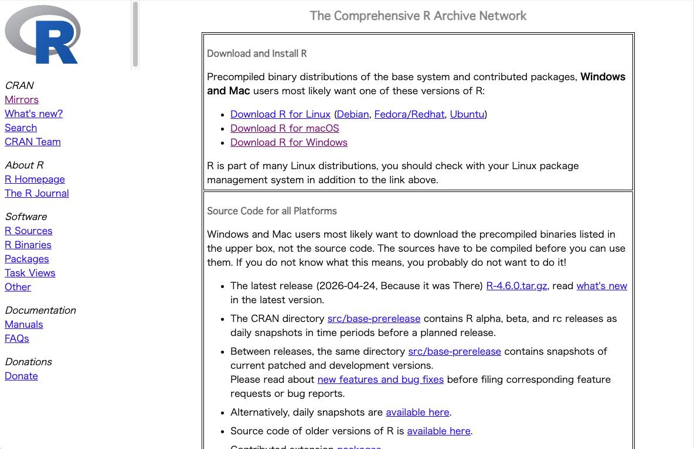

:::{.panel-tabset}
### macOSの場合

-   「Download R for macOS」をクリック
-   ご自身のOSバージョンに従い、「R-4.6.0-arm64.pkg」もしくは「R-4.6.0-x86_64.pkg」をクリック

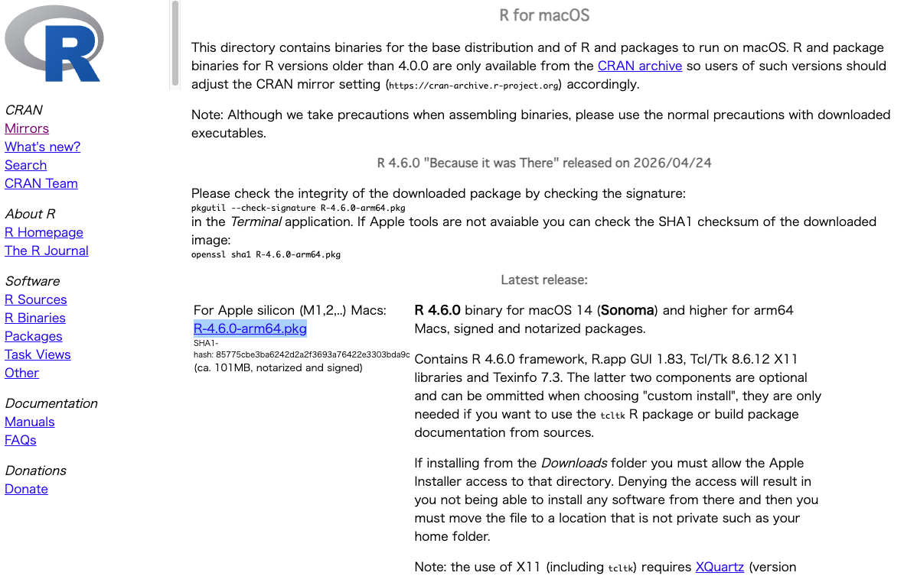

-   pkgファイルがインストールされるので、インストーラーを開き、指示に従って「続ける」「同意する」をクリック

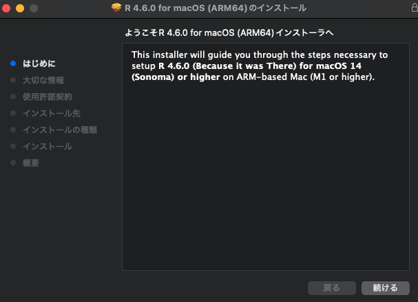

-   以下の場合にも「同意する」をクリック

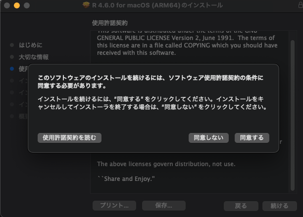

-   最後に「インストール」をクリックするとインストールが開始されます。

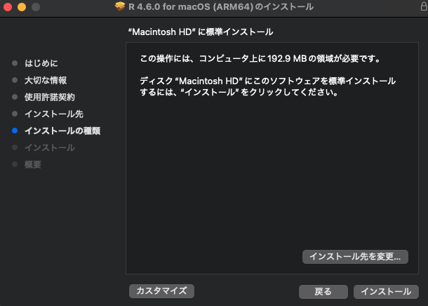

-   「インストールが完了しました」と表示されたら「閉じる」をクリックし、インストーラーはゴミ箱に入れてしまう。
-   「アプリケーション」を確認すると、「R」がインストールされているはずなので、わかりやすいようにDock（デスクトップに表示されるアプリケーションバー）に移しておく。（ドラッグ&ドロップで移動できるはず）

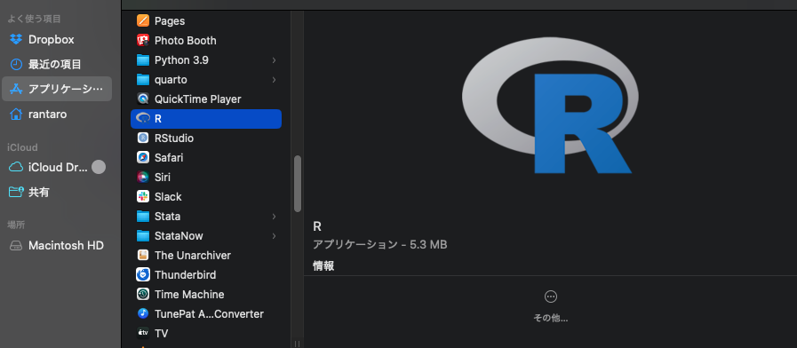

### windowsの場合

-   「Download R for Windows」をクリック
-   「Install R for the first time」をクリック

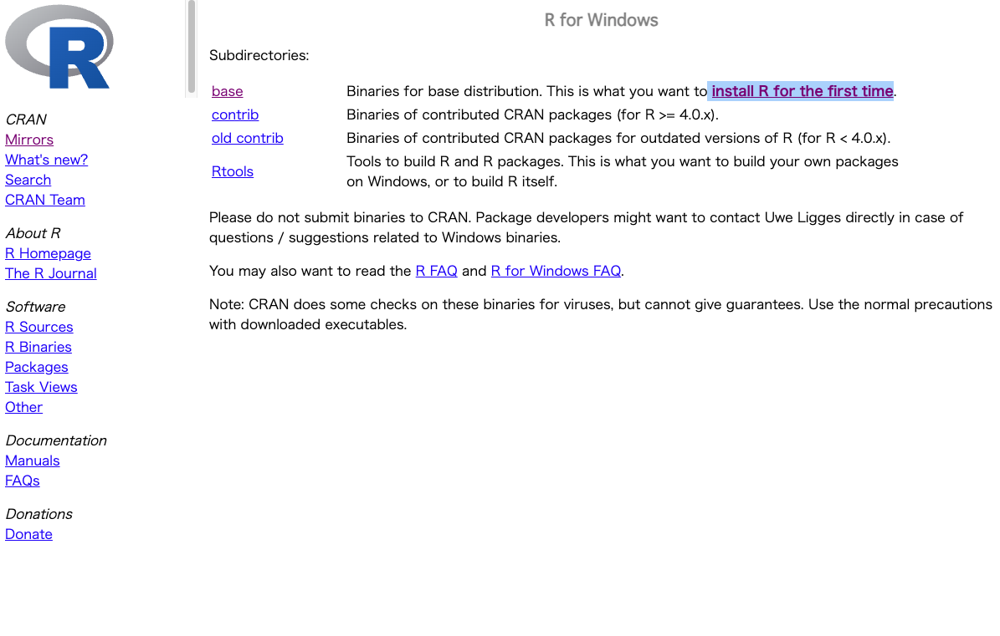

-   「Download R-4.6.0 for Windows」をクリック（バージョン番号は順次更新される）

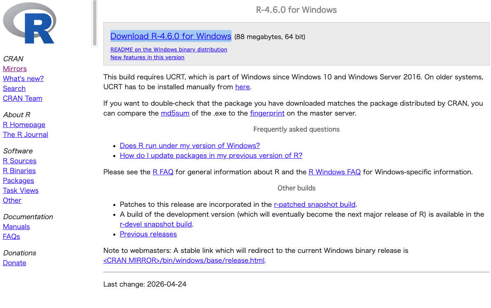

-   インストーラー（R-4.6.0-win.exe）を起動する
-   セットアップ言語の選択画面が表示されたら、「日本語」を選択し「OK」をクリック
-   指示に従って「次へ」をクリック
-   「コンポーネントを選択」が表示されたら、「Main Files」など全てにチェックを入れて「次へ」をクリック
-   「起動時オプション」は「いいえ」が良いと思います。
-   指示に従って「次へ」をクリックし、「完了」をクリック

:::

## R Studioのインストール

　Rだけでも分析はできますが、よりやりやすく効率的に分析を行うために、R Studioという統合開発環境（IDE）をインストールします。[こちら](https://posit.co/download/rstudio-desktop)にアクセスしてください。

:::{.panel-tabset}
### macOSの場合

-   画面をスクロールし、「macOS 14/15/26」の箇所にある「
RStudio-2026.04.0-526.dmg」をクリック

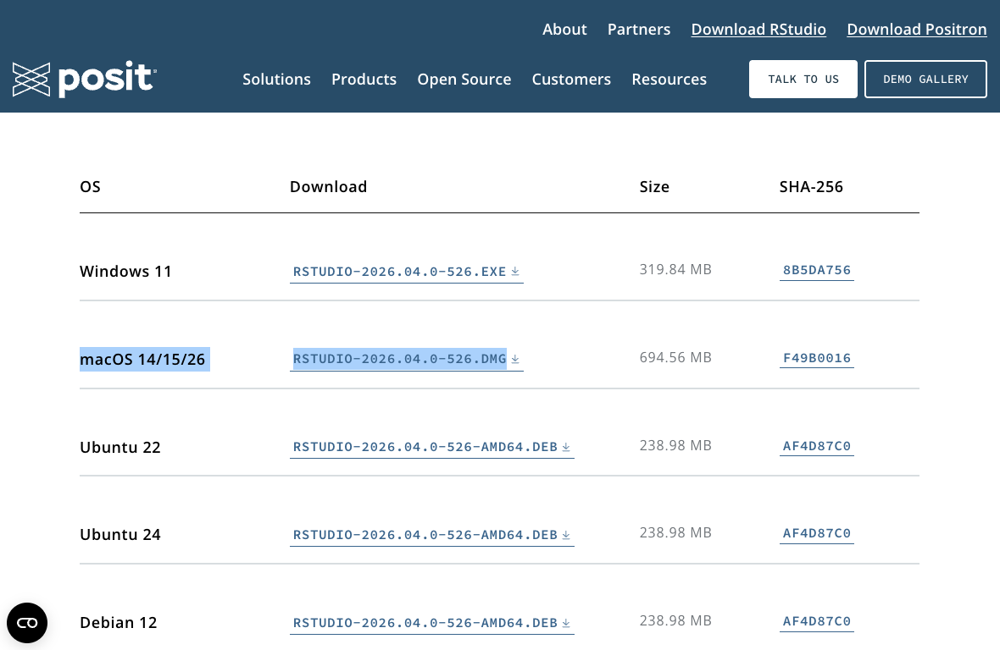

-   インストーラーを起動すると、「アプリケーション（Applications）」と「RStudio.app」のフォルダが表示されるので、「RStudio.app」を「アプリケーション（Applications）」にドラッグ&ドロップ
-   アプリケーション一覧から、「RStudio」を開く
-   必要に応じて、Dockに「RStudio」を移しておく

### windowsの場合

-   画面をスクロールし、「Windows 11」の箇所にある「
RStudio-2026.04.0-526.exe」をクリック

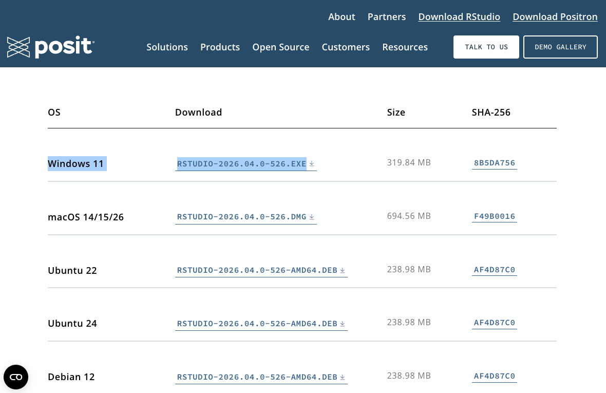

-   勝手にダウンロードが始まる
-   インストーラーを起動し、指示に従って「次へ」をクリック
-   スタートメニューの選択が表示されたら、そのまま「インストール」をクリック
-   「完了」をクリックし、完了
:::

## R/RStudioを開く

　インストールが完了したら、R Studioを開いてみましょう。おおよそ以下のような画面が表示されるはずです（画面が暗いのは設定の問題なので、白で問題ありません）。

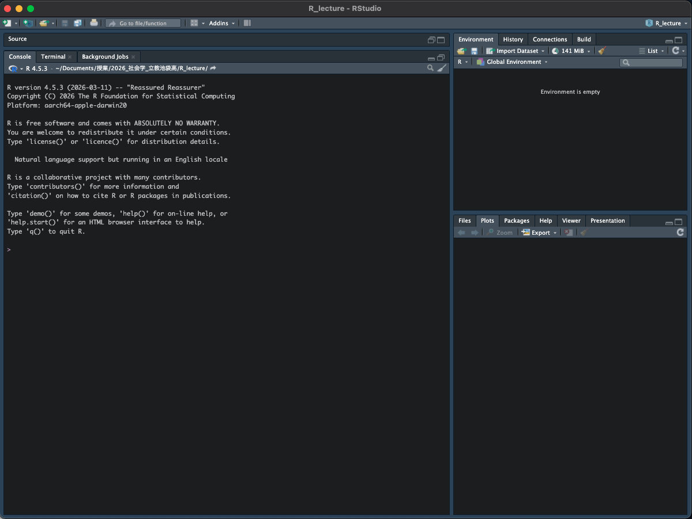

　左側の「>」が見えるパネルがコマンドを打ち込むconsoleという箇所です。右側の上部は、現在あるオブジェクト（データセットなど）が表示される箇所です。右下には、フォルダ内に保存されているファイルや、分析結果のプロットなどが表示されます。

## 分析用フォルダの作成

　本授業で使用するRのコードや分析用データをわかりやすく管理するために、みなさんのPCのお好きな箇所に、授業用のフォルダを作成しておきましょう。作成しないと、後ほどどこのフォルダにデータやコードが置かれているのかわからなくなってきます。
　
　おすすめの方法としては、ご自身のPCのローカルの「文書」フォルダに、「授業」などのフォルダを作成し、そのまた中に、「XXXX（授業名）」というフォルダを作成します。そのフォルダの中に、今後分析用ファイルを入れていけば、綺麗に整理され、わからなくなることはないと思います。

:::{.callout-note}
## 分析用フォルダの構造の例

-       文書
        -       授業
                -       社会学
                -       社会調査演習
                -       社会統計学
                -       ・・・（授業名）

:::

## R Projectの作成

　次に、R Projectというものを作成します。R Projectは、分析に使うデータセットや分析コードなどを一つのフォルダにまとめる役割を持ちます。作業手順は以下の通りです。

-  R Studioの左上部のバーにある左から2つ目のアイコン（Rと書かれている青色のもの）をクリック

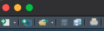

-  「New Directory」をクリック

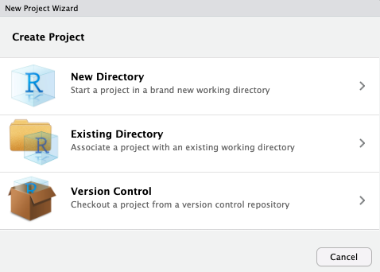

-  「New Project」をクリック

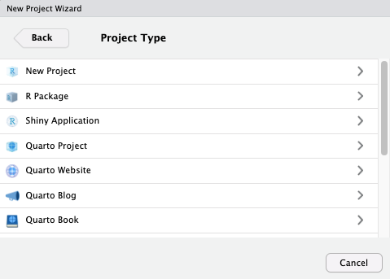

-  「Directory name」に、わかりやすい名前をつける（「授業名(英語)」など）
-  右側にある「Browse...」をクリックし、R Projectの保存場所を選択（先ほど作成した授業用フォルダ内に保存するとわかりやすい）

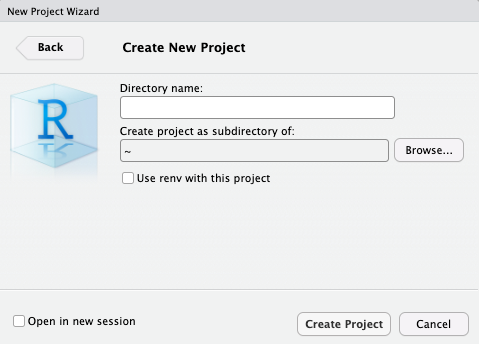

-  これでR Projectが完成する

## R コードの作成

　次に、作成したR Project内に、Rの分析用コードを作成していきます。

-  R Studioの左上部のバーにある左から1つ目のアイコン（+と書かれている白色のもの）をクリック

-  「R script」をクリック

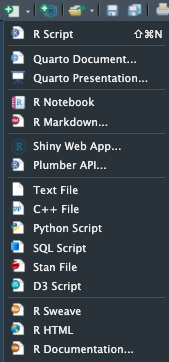

-  「Untitled1」という新たなタブがR Studio画面の左上に表示される

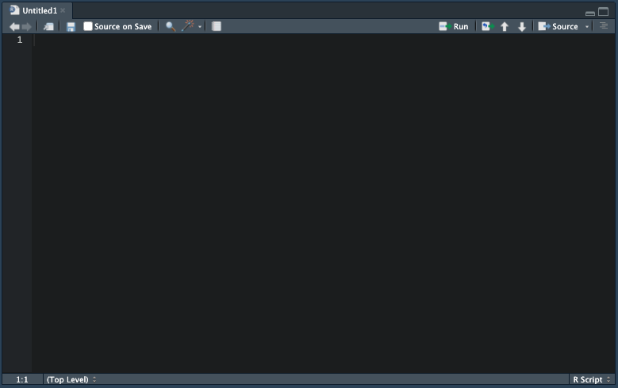

-  「command + S」（windowsの場合は「Ctrl + S」？）を押して保存
-  保存画画面が出るので、適当な名前をつけ、先ほどのR Projectと同じ箇所に保存

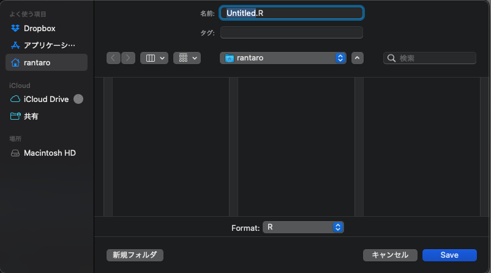

-  R Studio画面の右下のタブのうち「Files」をクリック
-  先ほど作成したRコードが含まれていれば成功（拡張子は「.R」）

ここまで実行すれば、Rで分析を行う準備は完了です。

## 文献情報

-   星野匡郎・田中久稔，2016，『Rによる実証分析ーー回帰分析から因果分析へ』オーム社．

