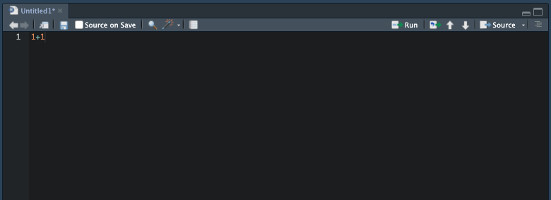

## 基礎的な操作方法

　「2.Rの準備」で作成したR script（.R）にコードを記載していきます。たとえば、以下のように入力してみてください。その上で、「1+1」と記載した行にカーソルを置き、「command + enter」（Windowsの場合は「Ctrl + enter」）を押すと、コードが実行されます。左下のconsoleに1+1の計算結果が表示されるはずです。

```{r}
1 + 1
```



　ちなみに、consoleに直接「1+1」と入力しても計算ができます。ただ、今後複雑なコードを書くときには、「.R」のコードとして保存しておく必要があるため、左上のコードウィンドウでコードを記載することをお勧めします。

　このように、左上のコードウィンドウでコードを書き、「command + enter」（Windowsの場合は「Ctrl + enter」）で実行することで、分析を実行することができます。

## 算術演算子

　ここでは、基本的な算術演算子を紹介します。

### 四則演算子

:::{.panel-tabset}
#### 加法

```{r}
2 + 3
```

#### 減法

```{r}
2 - 3
```

#### 乗法

```{r}
2 * 3
```

#### 除法

```{r}
2 / 3
```

:::

### そのほかの基本的な演算子

:::{.panel-tabset}

#### べき乗

```{r}
2 ^ 3
```

#### 整数の割り算の商

```{r}
10 %/% 3
```

#### 整数の割り算のあまり

```{r}
10 %% 3
```

:::

### 数学演算子

:::{.panel-tabset}

#### 平方根

```{r}
sqrt(36)
```

#### 絶対値

```{r}
abs(-90)
```

#### 合計

```{r}
sum(1:10)
```


#### 四捨五入

```{r}
round(123.456,2)
```

round(x,y)のうち、yの方で、桁数を指定。負の数にすると10の位、100の位まで丸める。

```{r}
round(123.456,-1)
```

#### 対数

```{r}
log(10)
```

デフォルトでは底をeとした自然対数。オプションでbase=yとすればyを底とした対数になる。

```{r}
log(100, base=10)
```

#### 指数関数

```{r}
exp(2)
```

:::


## 代入演算子

　Rでは、何らかの値やベクトル（値が並んだもの）をオブジェクトに代入（格納）することができます。たとえば、xというオブジェクトに何らかの値やベクトルを格納します。

```{r}
x <- 6
```

　これを実行すると、右上の「Environment」の箇所に、「x」というvalueが追加されます。これは、このR Projectに、6という数値が格納された「x」というオブジェクトが作成されたことを意味します。

　これは、ベクトルでも同様です。Rでは、ベクトル（数値の列）を表す際に、c()という表現を使用します。たとえば、以下を実行してみてください。

```{r}
y <- c(1,2,3,4,5)
```

　すると、「Environment」の欄に、「y」というオブジェクトが追加されます。この「y」には、「1,2,3,4,5」の連続する1から5の整数が格納されています。

　あるいは、c(1,2,3,4,5)は、以下のようにも表現できます。連続する整数は、c(1:5)のように省略して表現できます。

```{r}
z <- c(1:5)
```

## 比較演算子

### 等号・不等号

　次に、代表的な比較演算子を紹介します。

- 等しい：右側と左側が等しい場合にはTRUE、等しくない場合にはFALSEを返します。

```{r}
x <- 5  # xに5を代入
x == 4
```

- 等しくない：右側と左側が等しくない場合にはTRUE、等しい場合にはFALSEを返します。

```{r}
x != 4  # xには5が代入されている
```

### 大小比較

- 適合すればTRUE、そうでなければFALSEを返します。

```{r}
x > 5  # xが5より大きいかどうか
x < 6  # xが6未満かどうか
x >= 5  # xが5以上かどうか
x <= 6  # xが6より小さいかどうか
```

## 論理演算子

　次に、代表的な論理演算子を紹介します。

- 論理積（かつ）：&の右側と左側がともにTRUEであればTRUE、そうでなければFALSE

```{r}
x <- 5  # xに5を代入
y <- 3  # yに3を代入
x == 5 & y == 3  # x=5かつy=3のときにTRUE、そうでないときにFALSE
```

- 論理和（または）：&の右側と左側のどちらか一方がTRUEであればTRUE、そうでなければFALSE

```{r}
x <- 5  # xに5を代入
y <- 3  # yに3を代入
x == 5 | y == 4  # x=5またはy=4のときにTRUE、そうでないときにFALSE
```

- %in%演算子：左側の要素が右側のベクトルに属しているかを判定し真偽を判定する。

```{r}
x <- 5  # xに5を代入
x %in% c(1:5) # xが、1~5の整数の中に含まれているかどうか？
x %in% c(9:12) # xが、9~12の整数の中に含まれているかどうか？
```

パイプ演算子：左側を右側の関数の最初の引数に渡す。

```{r}
1:10 |> sum() # 1~10の整数のベクトルを、sum()（合計）に渡す
```


