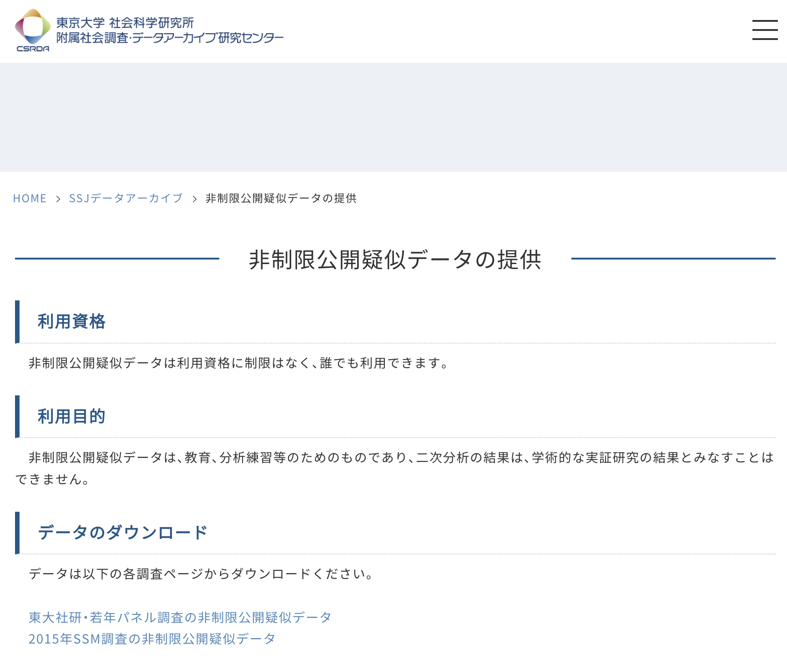
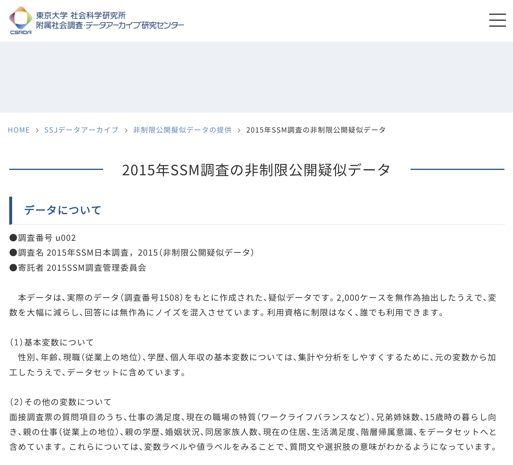

## 非制限公開疑似データとは

　この授業では、「非制限公開疑似データ」というものを使用します。実際に行われた社会調査データは，当然ではありますが、さまざまな調査対象者の個人情報が含まれていますので、扱いには十分に注意する必要があります。SSJデータアーカイブも、非常に多くの社会調査データを公開していますが、それらを利用する際には、十分に訓練された研究者が、個人情報の取り扱いに気をつけて使用する必要があります。

　社会調査の授業は、あくまでも練習ですから、実際に行われた社会調査データを使用する必要性は必ずしもありません。そのようなニーズに対応するために、SSJデータアーカイブは、「非制限公開疑似データ」という、実際のデータにランダムなばらつきを付与して、（つまりノイズを加えて、）練習用に使用できる架空のデータを提供しています。**これらの調査データは、あくまでも疑似データなので、研究成果として公に出すことはできませんお気をつけください。**

　今回の授業では、この練習用データを使用して、社会調査データの統計分析の方法を学んでいこうと思います。

## 非制限公開疑似データの入手方法

　[SSJデータアーカイブのページ](https://csrda.iss.u-tokyo.ac.jp/infrastructure/urd/)へアクセスしてください。2026年時点では、「東大社研・若年パネル調査の非制限公開疑似データ」と、「2015年SSM調査の非制限公開疑似データ」が利用可能です。今回は、「**東大社研・若年パネル調査の非制限公開疑似データ**」の方を使用します。



　「**2015年SSM調査の非制限公開疑似データ**」をクリックすると、疑似データについての説明ページに飛びます。それらを確認した上で、「データのダウンロード」の箇所にある、「u001」をクリックしてください。すると、ダウンロードが開始されます。



　ダウンロードされたファイルはzipで固められていると思うので、各自のPCで展開し、使用してください。展開されたデータを、授業フォルダ内などに作成した、**R projectと同じ場所に保存してください**。適切な場所に保存されれば、R studioの右下の「files」の箇所に、「u001」のファイルが表示されるはずです。

## データの読み込み

　R Studioにデータを読み込む場合には、以下のようにコマンドを実行する。

### .savファイルの場合

```{r}
library(haven)

# "u001.sav"という名前で保存されたデータを読み込み、dataというobjectに格納
data <- read_sav("u001.sav")

```

### .dtaファイルの場合
```{r}
library(haven)

# "u001.dta"という名前で保存されたデータを読み込み、dataというobjectに格納
data <- read_dta("u001.dta")

```

### .csvファイルの場合
```{r}
# "u001.csv"という名前で保存されたデータを読み込み、dataというobjectに格納
data <- read.csv("u001.csv")
```
　