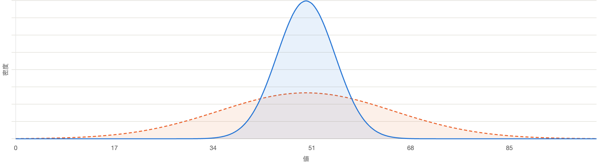
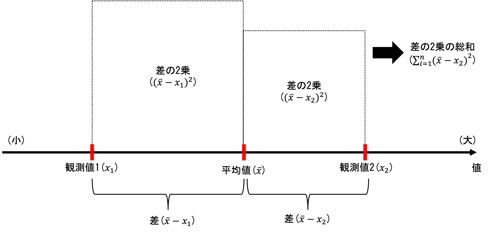
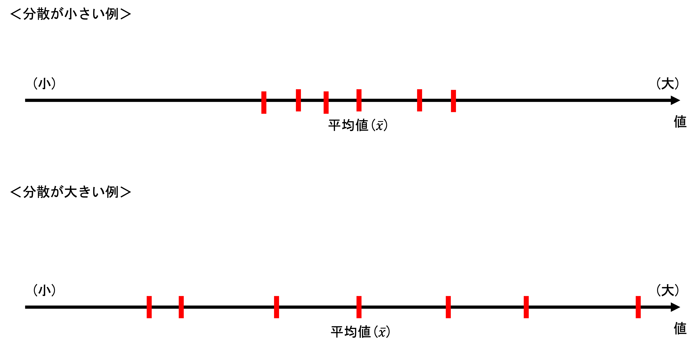

## 質的変数の要約
　質的変数の要約には、カテゴリ（値）ごとの出現度数（頻度）をカウントした、**度数分布表**が使用されることが多い。度数分布表にまとめる際には、わかりやすいように、そのカテゴリが全体に占める割合を示すのが一般的である。

　Rで度数分布を確認したい場合には、以下のように行う。

:::{.callout-warning icon="false"}
### 度数分布の作成方法
```{r, message=FALSE}
#install.packages("dplyr") # インストールしていない場合
#install.packages("haven") # インストールしていない場合
library(dplyr) # dplyrというパッケージを使用（count関数）
library(haven) # データ読み込みの際に使用

# データの読み込み（まだ読み込んでいない場合）
data <- read_sav("u001.sav")

# 問50（婚姻状態）の度数分布を確認
data |> count(ZQ50)

```

:::

　婚姻状態（質的変数）の度数分布表が作成される。

　これに、割合を付け加えたい場合には、以下のように実行する。

:::{.panel-tabset}
### パーセント表記
```{r, message=FALSE}
data |> count(ZQ50) |>
  mutate(prop = n / sum(n) * 100)
```

### 小数表記
```{r, message=FALSE}
data |> count(ZQ50) |>
  mutate(prop = n / sum(n))
```

### 小数点を揃えたい
```{r, message=FALSE}
data |> 
  count(ZQ50) |> 
  mutate(prop = round(n / sum(n) * 100, 0))
```
:::

:::{.callout-note}
#### グループ・ワーク

**調査対象者の学歴の度数分布表を作成してみましょう。**

:::

## 量的変数の要約
### 代表値
　量的変数の中心傾向をひとつの数値で示したものを、**代表値**と呼ぶ。代表値の中でも基本的なものが、**平均値**である。平均値には、いくつかの種類があるが、ここでは最も一般的な**算術平均値**について扱う。

:::{.callout-warning icon="false"}
#### 平均値
　平均値（$\bar{x}$）は、$n$個の観測値の総和を、$n$で割ったものである。

$$
\bar{x} = \frac{1}{n}\sum_{i=1}^{n} x_i
$$
:::

　ある連続変数の平均値をRで計算するには、以下のように実行する。

　例えば、問35（階層帰属意識）を連続変数とみなし、その平均を計算するとする。
```{r, message=FALSE}
# まず、前提として度数分布を確認する
data |> count(ZQ35)

# 無回答（99）があるので、これは欠損値（NA）に指定する
data2 <- data |>
  mutate(ZQ35 = ifelse(ZQ35==99,NA,ZQ35))
data2 |> count(ZQ35)

# 欠損値NAを除いた上で、平均値を計算する
mean(data2$ZQ35, na.rm = TRUE)

# あるいは、次のような方法でも計算できる
data2 |>
  summarise(mean = mean(ZQ35, na.rm = TRUE))
```

　この方法で、平均値が計算できた。しかし、平均値は万能ではない。平均値は、外れ値に弱く、外れ値の影響を受けやすい。例えば年収を例にとると、年収の高いごくわずかな観測値の影響を大きく受けてしまうことがある。以降では、年収を例に、平均値の抱える問題点を説明する。

```{r, message=FALSE}
# 年収（あなた個人）の度数分布を確認する
data |> count(ZQ47A)

# 現状では、1~14の値になっているので、これを階級値に変更する
# 今回は、説明の都合上、0万円はNAとする
data3 <- data |>
  mutate(income = case_match(ZQ47A,
                               1  ~ NA,
                               2  ~ 12.5,
                               3  ~ 50,
                               4  ~ 100,
                               5  ~ 200,
                               6  ~ 300,
                               7  ~ 400,
                               8  ~ 500,
                               9  ~ 700,
                               10 ~ 1000,
                               11 ~ 1500,
                               12 ~ 2000,
                               13 ~ 2250,
                               14 ~ NA,
                               99 ~ NA))
data3 |> count(income)
```

　次に、年収の分布を、**ヒストグラム**でわかりやすく視覚化してみる。

```{r, message=FALSE}
hist(data3$income, breaks=seq(0,2300,100), main = "income", xlab = "income")
```

　ヒストグラムを眺めてみると、0万円に近いほど度数が大きく、年収が多くなるに従って、おおよそ度数が小さくなることが確認できる。

　これをふまえ、年収の平均値を計算する。

```{r, message=FALSE}
mean(data3$income, na.rm = TRUE)
```

　この平均値は、低収入の観測値が多いにも関わらず、比較的大きく計算されている。これは、少ない外れ値の影響を受けているためである。

　外れ値に引っ張られないような代表値として、**中央値**（**メディアン**）と**最頻値**（**モード**）がある。

:::{.callout-warning icon="false"}
#### 中央値と最頻値
- **中央値**：データを大きい（小さい）順に並べた時、ちょうど真ん中に位置する値のこと。ケース数が偶数の場合、ちょうど真ん中の値を決定することができないが、この場合には中央の2つの値の平均を取る。
- **最頻値**：データの中で、最も多く存在する数値やカテゴリのこと。名義変数にも使用することができる。
:::

　中央値の計算には、以下のようなコマンドを実行する。

```{r, message=FALSE}
median(data3$income, na.rm = TRUE)
```

　最頻値を調べたい場合には、先ほど示したような度数分布表を出力すれば良い。

　今回の例は、そこまで大きな乖離はなかったものの、平均値のみから分布の特徴を判断することは危険である。分布を確認してみて、左右対称から大きく外れる場合には、他の代表値も使用するべきである。

　さらに、分位数やパーセンタイルも重要な代表値である。

:::{.callout-warning icon="false"}
#### 中央値と最頻値
- **分位数**：変数の分布を、任意の数の同じ大きさの集団に分割する数値。例えば、4分割の場合、分布の$\frac{1}{4}$がそれ以下に入る点を第1四分位数（$Q_1$）と呼び、同様に$\frac{2}{4}$を第二子分位数（$Q_2$）と呼ぶ。
- **パーセンタイル**：分位数の一種で、データを小さい順に並べた場合に、任意の%の序列上に位置する数値を指す。（=百分位数）
:::

　分位数の計算は、以下のように行うことができる。

```{r, message=FALSE}
# 四分位数の計算
quantile(data3$income, na.rm = TRUE)

# 任意のパーセンタイルを計算したい場合（例：20%と80%）
quantile(data3$income, probs = c(0.2, 0.8), na.rm = TRUE)

```

### 散布度
　代表値だけでは、変数の分布の特徴を表すには不十分である場合が多い。その場合には、変数のばらつきの特徴を見る必要がある。そのような場合に、様々な**散布度**が有用である。

　例えば、1組と2組の間のテストの得点の分布を比較するとする。両クラスとも、平均点は60点だとしても、点数の分布が異なる場合がありうる。このような場合に、変数のばらつきを示す数値が計算できると、両クラスの分布を比較することができる。



　まず、もっとも基本的な散布度に、**分散**がある。

:::{.callout-warning icon="false"}
#### 分散
分散（$s^2$）とは、個々の値（$x_i$）と平均値（$\bar{x}$）との差（**偏差**）を2乗して足し合せ（**偏差平方和**）、ケース数（$n$）で割ったもの。
$$
s^2 = \frac{1}{n}\sum_{i=1}^{n} (x_i - \bar{x})^2
$$
:::

　この数式の意味を、よりわかりやすく示すと、以下のようになる。

::: {.panel-tabset}
##### 分散の計算イメージ


##### 分散の大きさのイメージ

:::

　分散を手計算する場合には、以下のような流れとなる。

```{r, message=FALSE}
# 先ほどと同様に、収入変数を使用する
# 収入変数の、最初の10行だけ表示してみる
data3 |> 
  select(income) |> 
  head(10)

# （1）平均値を計算し、mean_ZQ74Aというobjectに格納
mean_ZQ74A <- mean(data3$income, na.rm = TRUE)
mean_ZQ74A # しっかりと格納された

# （2）観測値から、平均値（mean）を引き算した変数（a）を作成する
data3 <- data3 |>
  mutate(mean = mean_ZQ74A,
         a = income - mean)

data3 |>
  select(income, mean, a) |>
  head(10)

# （3）試しに、aをたしあわせてみる→0に限りなく近い
sum(data3$a, na.rm = TRUE)

# （4）平均値（mean）を引き算した変数（a）を2乗した変数（b）を作成する
data3 <- data3 |>
  mutate(b = a^2)

data3 |>
  select(income, mean, a, b) |>
  head(10)

# 最後に、bを足しあげ、サンプルサイズで割れば、分散が計算できる
sum(data3$b, na.rm = TRUE) # bの合計

n <- sum(!is.na(data3$income)) # サンプルサイズを計算し
n

sum(data3$b, na.rm = TRUE)/n # bの合計をnで割る
```

　このようにして、分散は計算できる。このような式で計算できる分散は、**標本分散**と呼ばれる。なお、標本分散とは別に、母集団の分散の推定値である、**不偏分散**というものもある。不偏分散は、以下の式によって計算される。

:::{.callout-warning icon="false"}
#### 不偏分散
$$
\hat{\sigma^2} = \frac{1}{n-1}\sum_{i=1}^{n} (x_i - \bar{x})^2
$$
:::

　不偏分散は、偏差平方和をサンプルサイズ-1で割ったものである。この不偏分散は、平均的には母分散（母集団の分散）に一致する。この点は、統計的推測の箇所で詳しく学ぶ。

　不偏分散は、以下のコマンドによって計算することができる。

```{r, message=FALSE}
var(data3$income, na.rm = TRUE)
```

　分散の平方根を取ったものを、**標準偏差**と呼ぶ。分散は、偏差を2乗してたしあわせているため、値が大きくなる上に、元のデータと同じ単位で表現できない。そこで、分散の平方根を取ることで、元のデータと単位を揃えることができる。

:::{.callout-warning icon="false"}
#### 標準偏差
$$
s = \sqrt{s^2}
$$
:::

　したがって、先ほどの分散の計算結果に対して、平方根を取れば良い。

```{r, message=FALSE}
sqrt(sum(data3$b, na.rm = TRUE)/n)
```

　分散と同様に、不偏標準偏差は、以下のようにコマンドで計算することができる。

```{r, message=FALSE}
sd(data3$income, na.rm = TRUE)
```

　このようにして、分散と標準偏差を計算することができるが、これらの値は、測定単位が異なる変数同士を比較することができない。例えば、10点満点のテストと100点満点のテストでは、同じばらつきであったとしても、標準偏差は100点満点のテストの方で大きく計算されてしまう。これでは、純粋にばらつきの大きさを比較できない。

　そこで、変数の測定単位を考慮するために、標準偏差を、さらに平均値で割った、**変動係数**というものが使用される。

:::{.callout-warning icon="false"}
#### 変動係数
$$
cv = \frac{s}{\bar{x}}
$$
:::

　変動係数は、標準偏差を平均値で割れば良いので、Rでは以下のように計算できる。

```{r, message=FALSE}
cv <- sd(data3$income, na.rm = TRUE)/mean(data3$income, na.rm = TRUE)
cv
```

### グループ比較
　これまでにみてきた代表値・散布度は、グループ間で比較して初めて意味をなす。そこで、社会的属性間での収入の代表値・散布度の違いを比べてみよう。

　まず、性別ごとに、収入の代表値・散布度を比較してみる。

```{r, message=FALSE}
# （1）性別変数の度数分布を確認する
data3 |> count(sex)

# （2）性別で層化した上で、さまざまな代表値や散布度を計算する
data3 |>
  group_by(sex) |> # グループ分けする変数を宣言
  summarise(mean = mean(income, na.rm = TRUE), # 平均値
            median = median(income, na.rm = TRUE), # 中央値
            variance = var(income, na.rm = TRUE), # 分散
            sd = sd(income, na.rm = TRUE),# 標準偏差
            cv = sd/mean # 変動係数
            ) |>
  ungroup()
```

　収入について言えば、男性の方が平均値が高く、中央値も高い。ちらばりは、男性の方が大きいように見えるが、平均値を考慮した変動係数で比較すると、女性の方がばらつきが大きいことが確認できる。

:::{.callout-note}
#### グループ・ワーク

**調査対象者の学歴ごとに、収入の代表値・散布度を計算してみましょう。**

:::

### グラフの作成

　これまでに紹介した代表値や散布度を効果的に示すための、いくつかのグラフを紹介する。

　第1に、棒グラフは、グループ間の度数分布の違いを示すのに最適なグラフである。以降では、性別による健康状態の度数分布の違いを示す**棒グラフ**を作成してみる。

```{r, message=FALSE}
# まずは、健康状態の度数分布を確認
data |> count(ZQ25)
```

　健康状態の度数分布を確認すると、無回答（9）があるので、これはNA（欠損値）に変える。

```{r, message=FALSE}
data4 <- data3 |>
  mutate(health = case_match(ZQ25,
                             9 ~ NA,
                             .default = ZQ25))
data4 |> count(health)
```

　まずは、性別ごとの度数分布表を作成してみる。

```{r, message=FALSE}
data4 |>
  group_by(sex) |>
  count(health)
```

　性別ごとの度数分布表から、棒グラフを作成する。

```{r, message=FALSE}
library(ggplot2)
data4 |> 
  group_by(sex) |> 
  count(health) |> 
  ggplot(aes(x = factor(sex), y = n, fill = factor(health))) +
  geom_bar(stat = "identity")
```

　もし、見た目も整えたいのであれば、以下のようなコマンドを実行する。

```{r, message=FALSE,echo: false}
data4 <- data4 |>
  mutate(sex_fac = case_match(sex,
                              1 ~ "1. male",
                              2 ~ "2. female") |> factor(),
         health_fac = case_match(health,
                                 1 ~ "1. Very good",
                                 2 ~ "2. Fairly good",
                                 3 ~ "3. Average",
                                 4 ~ "4. Not very good",
                                 5 ~ "5. Poor") |> factor())
data4 |>
  group_by(sex_fac) |>
  count(health_fac) |>
  ggplot(aes(x = sex_fac, y = n, fill = health_fac)) +
  geom_bar(stat = "identity") +
  labs(x = "sex", y = "frequency", fill = "health")
```

:::{.callout-note}
#### グループ・ワーク

**調査対象者の性別ごとに、生活全般満足度（問30）の棒グラフを作成してみましょう。**

:::

　量的変数をグループ間で比較したい場合には、代表値と散布度をグループごとにグラフ化すると良い。その一例として、**箱ひげ図**がある。箱ひげ図は、例えば以下のように作成することができる。

　ここでは、例として、性別の収入を箱ひげ図にプロットしてみる。

```{r, message=FALSE}
#| warning: false
data4 |>
  ggplot() +
  geom_boxplot(aes(x = sex_fac, y = income)) +
  labs(x = "sex", y="income")
```

:::{.callout-note}
#### グループ・ワーク

**調査対象者の性別ごとに、階層帰属意識（問35）の棒グラフを作成してみましょう。**

:::

```{r, include=FALSE}
write.csv(data4,"data4.csv")
```